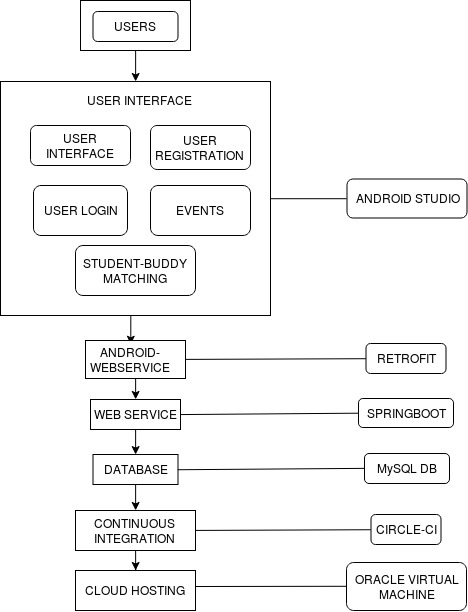
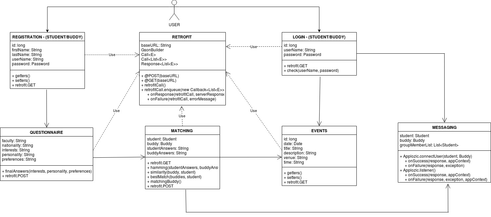
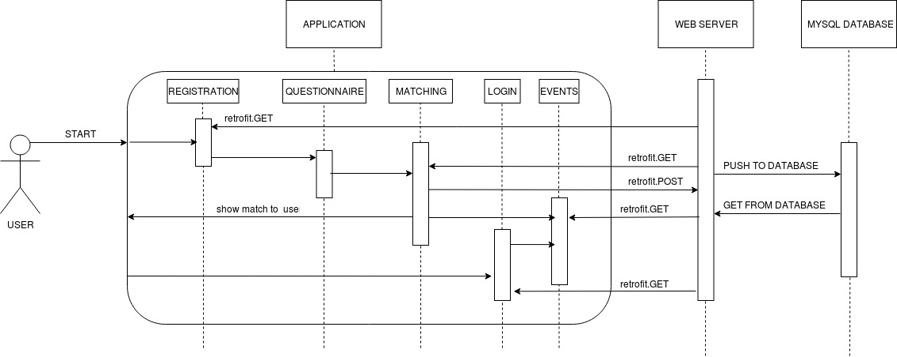
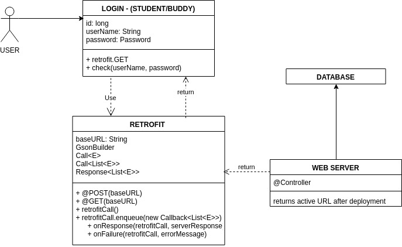
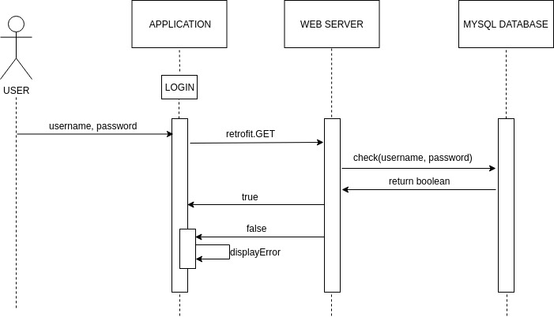

# System Architecture

* Since we are implementing a social application, we have chosen to build a Client-Server application.
* The three main components of our system is going to be the Application, the Server and the Database since we need to store information about the user as well as implement the functionality required by the system.
* We are integrating the main functions of the system with the Application which we are going to use to build the front-end of the architecture. Only the users will interact with this part of the system directly.
* The Application proceeds to interact with the server and provides the user details which allows the application to carry out the matching process for a student by checking for the closest possible match with all the buddies.
* The database stores the information from the application so this data can be retrieved from when the user logs back in. This also minimises the amount of data stored locally. This data includes the match information, usernames, passwords and information about the upcoming events. 
* We are using MySQL within the database to handle requests from the application to an extent. However, most of the interactions our database would be through the Spring Framework.
* We are using APIs to handle communication between all three components in our system.

___

# High Level Diagram

### User Interface
The front-end for the user. The application is the User-Interface which allows the user to:
*    **REGISTER** - Every new user must go through the registration process, followed by the _Matching Questionnaire_ in order to obtain a match. Doing so will allow the user to view the events, check the matched details and connect with the matched student or buddy. A switch is added on the Registration Page to ensure the registration for each buddy and student is taken care of separately.
*    **LOGIN** - Once the user registers, he/she is logged in by default. A Sign-In page is made to allow the user to sign in anytime after registration.
*    **VIEW EVENTS** - The home page of the application displays the list of existing events planned by the client. This allows the user to view the events, check the event details and mark the event as interested. 
*    **CHECK MATCH DETAILS** - The 'My Profile' page allows the user to view his/her user information, the matched student/buddy and also the common factors that helped them match. 
*    **COMMUNICATE** - Once matched, the user can either use the in-app messaging service to communicate with their respective match or use the user information provided in the _My Profile_ page to connect through other social media 

### Android to Web Service 
The application uses Retrofit, an HTTP client for Android. Retrofit allows the application to connect to the REST web service by translating the API into Java interfaces. Whenever a user registers, logs in or views the events, an API call is made to receive the information from the URL of the Web Service in the form of JSON objects. This allows the application to interface with the REST API without establishing any connections.

### Web Service
The server side of the application is implemented using SpringBoot. A REST Web-Service is created which connects to the database. All the information of Students, Buddies, Events and announcements are displayed on this web service and can be managed using CRUD (Create, Read, Update, Delete) operations which allows the website to work as a database. The service is secured using _MVC Web Config and Spring's WebSecurityConfigurer_ and is only accessible by the administrative team. The Oracle Virtual Machine provided by the university is used to deploy the Spring Application on cloud.

### Database
The Web Service establishes a connection to the _MySQL_ database. This forms the backend of the application and contains all the information posted from the application and Web Service. The database allows us to make selects for certain subsets of information about the users to avoid keeping a local copy of the data.

### Continuous Integration
To ensure the integration tests are run sequentially followed by an automated deployment, the system uses _Circle CI_. This makes project collaboration and testing easier.

### Cloud Hosting
Once the continuous integration is a success, the application is deployed onto _Oracle VM_, which is a Cloud Hosting Service. The server is set up using _nginx_.
___

# UML Class Diagrams

## Static UML - Complete System

## Dynamic UML - Complete System

## Class Description

### User
The Student and Buddy are the users of the application.

### Registration
When a user wants to register themselves, they provide their first name, last name, a unique username which is used as a primary key and a password. The key functions used in this class are as follows:
* *getters* - Initialise functions to get the user values.
* *setters* - Initialise functions to set the user values. 
* *retrofit.GET* - A retrofit call is used to check if the user has already created an account.

### Login
For a user login, a valid username and stored password must be entered 
* *retrofit.GET* - A retrofit call is used to receive the existing users from the database. 
* *check(userName, password)* - This function checks whether the entered username and password matches a row in the database.

### Questionnaire
The Questionnaire section comprises of two classes. The user selects checkboxes that describe them best from three different sections. These include _interests, personalities and their order of importance_. The latter means the user can choose the factors he/she feels must be prioritised for finding a suitable match.
* *finalAnswers(i, per, pre)* - This function gets all the selected options and store the respective sections as a string of bits.

### Matching
The crux of the application. This class gets the newly registered student and a list of buddies. The answers of each are extracted from their respective rows in the database in order to return the perfect match. The following functions are used to generate a match:
* *retrofit.GET* - As mentioned, a retrofit get call is made to get a list of all buddies with their answers to the questionnaire.
* *hamming(studentAns, buddyAns)* - Since the lengths of the user's answers are the same, we compute the hamming distance between the student and buddy's answer strings.
* *similarity(buddy, student)* - This function takes in a buddy and a student, calculates the similarity between that buddy and student's answers keeping track of the student's order of preferences.
* *bestMatch(buddies, student)* - This function iterates through the buddies list, calculates the similarities between each buddy and student's answers and returns the buddy who has the closest score to the student's answers.
* *matchingBuddy()* - This function update the newly matched buddy with the student's information.
* *retrofit.POST* - A retrofit call is used to store the data collected from the user interface into the database.

### Events
The Events activity and class is the home page of the application. All the current events added by the client are displayed in the form of a list on the main page. The user can select an event, view the event details and mark the event as interested.
* *retrofit.GET* - Since the events are only displayed, a retrofit GET API call is made to display the list of events in a customized list layout.

### Messaging
An open source messaging service provided by _Applozic_ has been integrated into the app to create groups and personal chat space for the buddy and his/her respective students. In order to make sure the conversations are only within the matched students and buddies, the database needs to be linked with the company's (Applozic) database. Once successful, the Messaging API provides a user object which then invokes respective methods to start a conversation. The conversations are stored in the form of JSON objects on Firebase which is secured.

---
# UML - Use case

#### Model Context
For simplicity, we have chosen to describe the sequence of our **User Login** use case through a static and dynamic UML diagram.

#### Motivation for choice
As we have seen from our architecture diagram, the system contains many components. The User Login use case chosen involves the interaction of all components, which gives the reader a better understanding of the system. 

## Static UML - User Login:

## Dynamic UML - User Login:

#### Modelling Choice and Knowledge gained
As we can see from above, the modelling choices for the UML examples are:
* **Static UML Example** - UML Class Diagram.
    * We decided to describe our User Login use case through a UML class diagram as this gives the reader an insight of the entire system as well as an overview of the synergy happening among the different system elements as well as their properties and relationships. 
* **Dynamic UML Example** - UML Sequence Diagram.
    * Using a sequence diagram, it is very easy to explain the reader the logical flow of the system. With the help of this, the reader can visualize and validate the respective runtime scenario and also predict how the system will behave for other functions.

